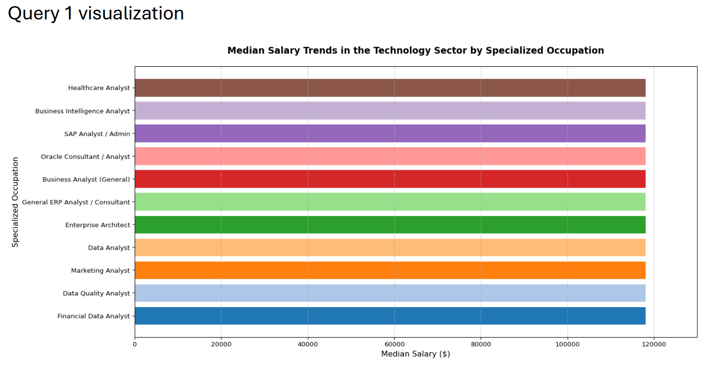
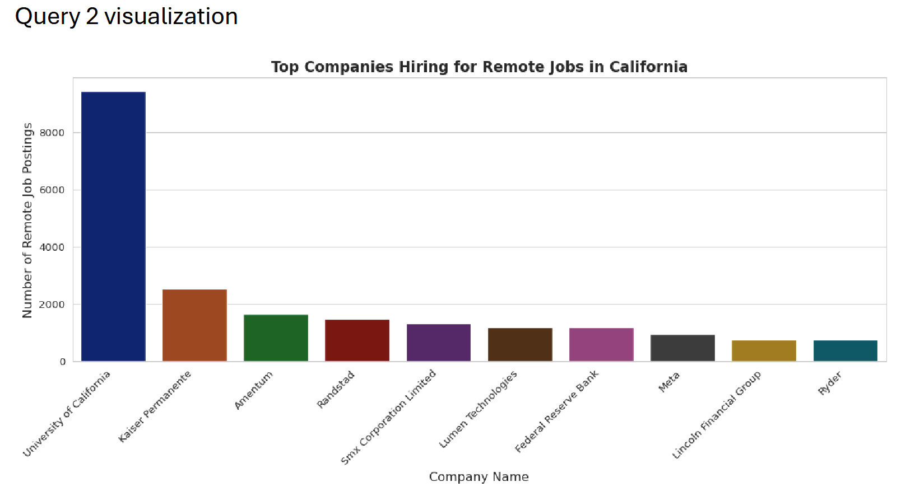

# Professional Projects

Unfortunetly due to the nature of my current job there are no references to my job at the unclassified level to share.

# Education Projects

While attending Boston University I have completed a few assignments that can be accessed via the linked provided. These were with the assistance of my professor and the lessons for the courses, but all documentation is attached to the attached GitHubs.

# Cloud Analytics for Business

<strong>Assignment 2</strong>

 

<h2>Assignment 2</h2>

Assignment description: This assignment was about sorting through data to look for key indicators such as average salary, monthly job posting trends in specific states, identifying specific companies that were hiring for remote jobs, and looking at median salary trends among other activities. These charts highlight the work that was done to accomplish some of these goals. Not only did we isolate the variables of salary, companies , remote work, and occupation, but we were also able to lay out the data in a readable and digestible way for a consumer that would be valuable for someone looking to enter the job market or gain insight into things such as the biggest remote working companies or what the average median pay could be for these types of jobs. This data could be sorted even further as this was just a baseline for the data.

<table>
<tr>

  

  

  

  

</tr>
</table>

[These are some of the graphs that were created for this assignment]

Link: [Assignment 2 GitHub](https://github.com/met-ad-688/assignment-02-gavinboss)

---

<strong>Assignment 3</strong>

 

<h2>Assignment 3</h2>

Assignment Description: This assignment focuses on the different industries and the pay differences that can be observed throughout them. This is something that was observed through LinkedIn data and could break out what types of job fields individuals may be interested in going into. Some of these graphs indicate that more specific jobs with unique skillsets have higher paying jobs but also show that those higher paying jobs may have less job postings overall. There was also the correlation of degree to pay, which is noted in the later charts and sorting through this data could indicate if pursuing a degree or more experience would be worth it for an individual in the long run.

<table>
<tr>

  

  

  

  

  

  

  

  

  

</tr>
</table>

[These are some of the graphs that were created for this assignment]

Link: [Assignment 3 GitHub](https://github.com/met-ad-688/assignment-03-gavinboss)

---

<strong>Assignment 4</strong>

 

<h2>Assignment 4</h2>

Assignment Description: This assignment focused on building and comparing multiple machine learning models—including Generalized Linear Regression, Polynomial Regression, and Random Forest—to predict salaries using job posting data. The project evaluated each model using performance metrics and visualizations, identified the most influential features affecting salary predictions, and compared model accuracy to determine the strengths and limitations of each approach.

<table>
<tr>

  

  

  

  

</tr>
</table>

[These are some of the graphs that were created for this assignment]

Link: [Assignment 4 GitHub](https://github.com/met-ad-688/assignment-04-gavinboss)

---

# Data Mining for Business Analytics

<strong>Assignment 1</strong>

 

<h2>Assignment 1</h2>

Assignment description: 

<table>
<tr>

  

  

  

  

  

</tr>
</table>

[These are some of the graphs that were created for this assignment]

Link: [Assignment 1 GitHub](https://github.com/gavinboss/AD699-Data-Mining-for-Business-Analytics/tree/main/Assignment%201)

---

<strong>Assignment 2</strong>

 

<h2>Assignment 2</h2>

Assignment description: 

<table>
<tr>

  

  

  

</tr>
</table>

[These are some of the graphs that were created for this assignment]

Link: [Assignment 2 GitHub](https://github.com/gavinboss/AD699-Data-Mining-for-Business-Analytics/tree/main/Assignment%202)

---