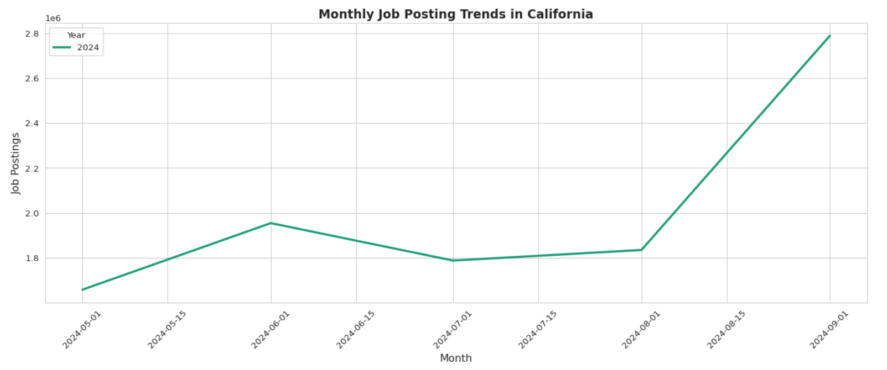
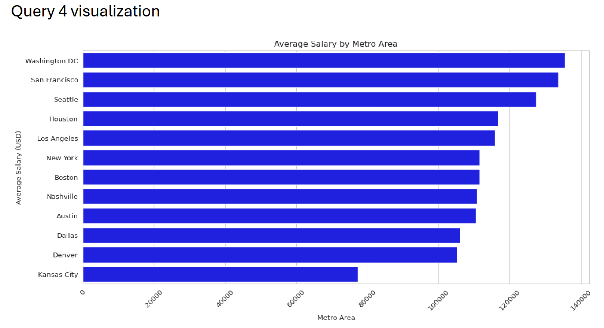

# Education Projects

While attending Boston University I have completed a few assignments that can be accessed via the linked provided. These were with the assistance of my professor and the lessons for the courses but all documentation is attached to the attached GitHubs.

# Assignment 2

  
  
  
  

---